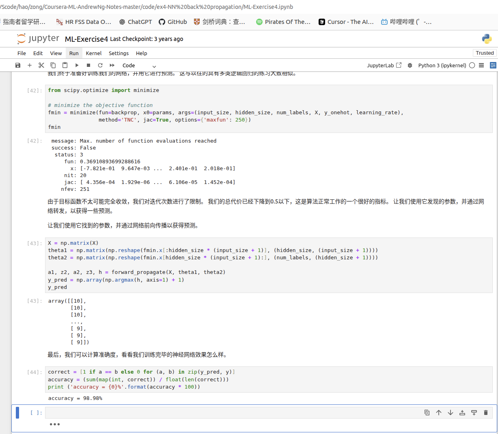
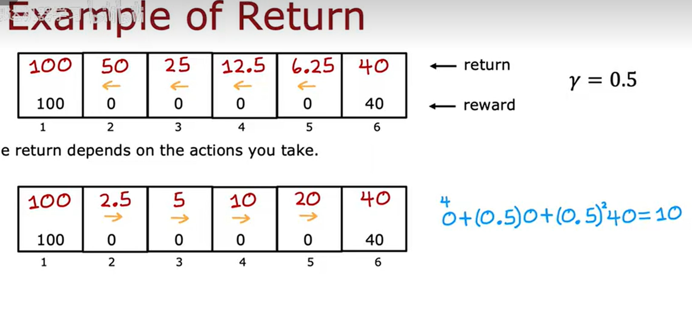

# 工作日志 -  吴恩达视频学习

## 代码练习
- **线性回归**
  - jupyter的exp1代码错误 
    - 遇到点问题，图片插入放到同级才成功
    - 把数据变成 scikit-learn 可接受的格式，之前版本过低
  - 
- **逻辑回归**
  - 分类
- **多类分类**
  - 分 为什么不分
- **神经网络**
  - 
- **网络训练调试**
  - 首先cursor修复版本问题
  ```/home/alex/VScode/hao/zong/Coursera-ML-AndrewNg-Notes-master/code/ex5-bias vs variance/修复说明.md```

## 正则化参数lambda设置
- 太小过拟合，太大J在训练集就会巨大

## 聚类
- kmeans
- elbow methods

## 强化学习
- 步长影响r的设置，怎么设置
  - 马尔可夫 markov decision process
- 
我靠 怎么ctrl+v直接图片出来了！！！
- QSA Q(spot *for example* ,status choice) 