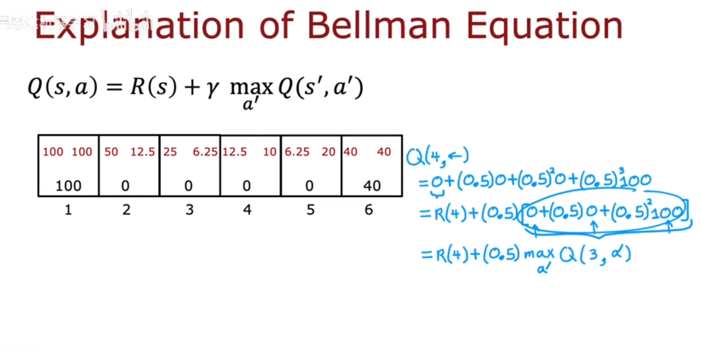
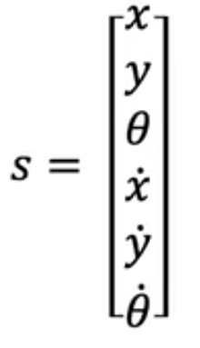
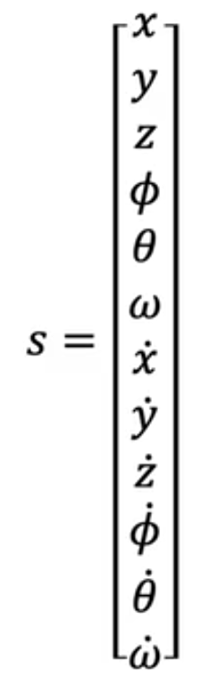
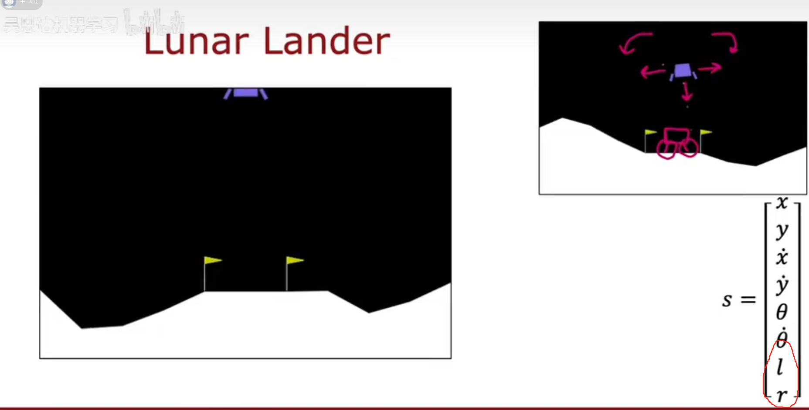
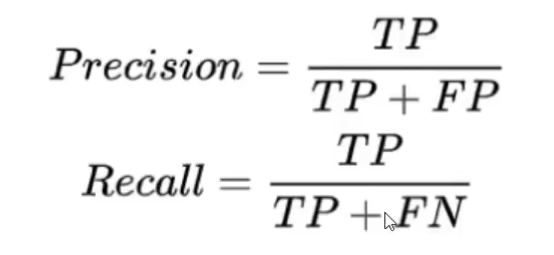
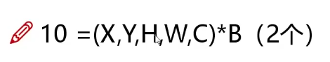

# 日志
## Reinforcement learning
- bellman equation 
> Bellman 方程：
$$
Q(s,a) = \sum_{s'} P(s' \mid s,a) \left[ R(s,a,s') + \gamma \max_{a'} Q(s',a') \right]
$$
---
- 不是 这强化学习好搞心态啊 环境一影响不纯纯变态吗 想让他干什么结果环境影响一下正好反向了 好强的随机性 所以加入统计学吗 期望E good 
---
- continuous state 
  - state can be 
  
  location and d(location)
  - also can be 
  
  roll(滚转) pitch（俯仰） yaw（朝向）
  - also canbe
  
  left & right leg (like final state) to confirm whether its sitting on the ground correctly
---
- real example to inplement
  - input [ s , a ]
  - output Q[ s , a ]
  Q where come from? dont know... init nobody knows
 > use bellman to train a Q
 DQN deep Q net
 ## improvement of DNQ
 - epsilon greedy policy

## Use MCP build LLM
- 算了先把yolo相关基础打好

## yolo for me
- 改进不能只盯着cv的东西看，多角度结合，比如只要是用来提取特征的都可以应用
  - 数据层面
  - 网络结构层面
  
- **YOLOv4**
  - drop block
    - dropout类似正则化，给照片随机涂黑，随机kill几个点
    - 而dropblock将特征完整涂黑（这不找罪受吗~），随机kill一个区域
  - label smooth
    - （0-1）改为（0.05-0.95）
    - 也是防止过拟合的一部分
- **YOLOv1**
  - 参数
    - IoU
    - mAP
      - 
  - 网络架构
    - 卷积
    - 池化
    - 全连接层：变为 M * N * ***30***其中30的前10中的两个5为归一化坐标
    B为框的个数
    后20为20分类中的各20类的置信度
  - 检测
    - 非极大值抑制 NMS
      -  防止同一个目标检测多次
- **YOLOv2**
  - 取消dropout用Batch normalization
> 这是怎么想到的 太厉害了
## **Transformer**
- 注意力机制
  - 比如把重点放在前景而不是背景 

卷积 池化 具体参数认真看 都有哪些优势 仔细琢磨
