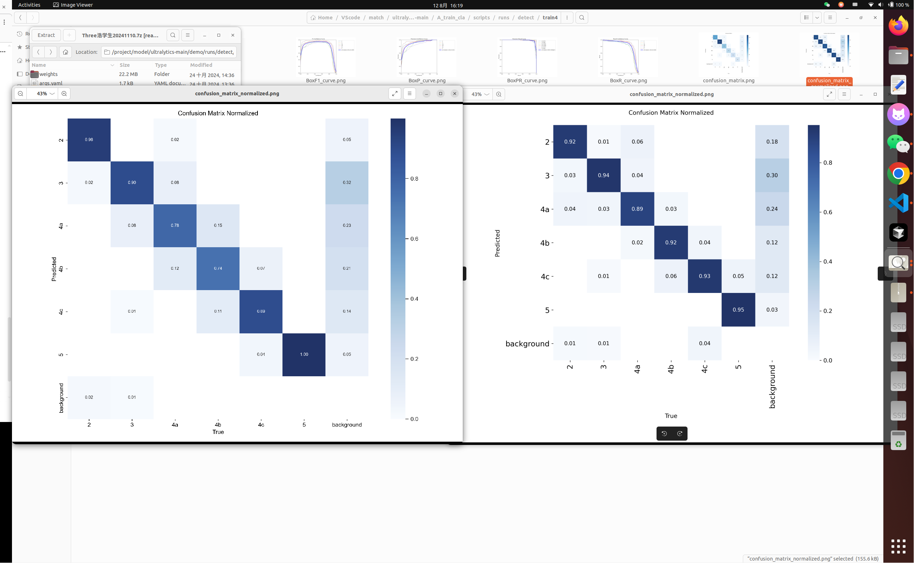

# 工作日志

## 上午

### 技术学习
- [x] https://www.researching.cn/ArticlePdf/m00006/2019/39/7/0715004.pdf
- [x] https://pmc.ncbi.nlm.nih.gov/articles/PMC8776556/?utm_source=chatgpt.com
  - GAN :它基本上由两个 CNN 网络组合而成：第一个称为生成模型，另一个是鉴别器模型。其中生成器网络试图通过生成接近真实的数据（例如，人造图像）来欺骗鉴别器网络，而鉴别器网络则试图区分生成器输出和真实数据。
> 看完发现DL还没学完
- [x] DL
  - 问题：``` /home/alex/VScode/hao/DL/深度学习入门/20250812_183802_神经网络训练问题解决.md```


## 下午

### yolov8
- [x] 调整超参
左边是调参前比赛的 右边是今天的

- 但是今天用错模型了用的detect，明天用cls试试，两个的yaml也是不一样的
