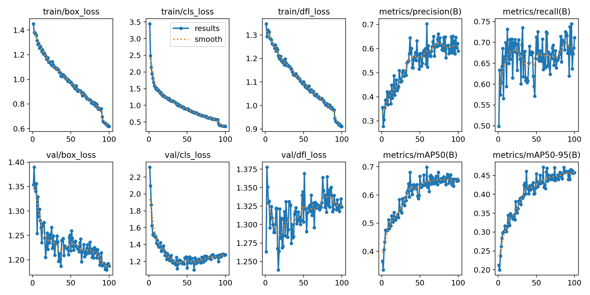
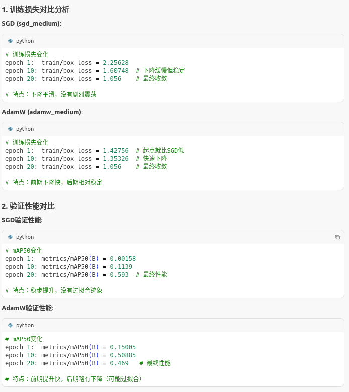

# 
## 调参
- baseline
  - 参数
    > model.train(
        data=config_path,   # 数据集 YAML
        epochs=100,         # 默认训练轮数
        imgsz=640,          # 默认图片尺寸
        batch=16,           # 默认 batch size
        val=True,           # 开启验证
        save=True,          # 保存权重
        verbose=True,        # 打印训练信息
        project="detect_for_cls",        # 项目名称
        name="baseline_cls",             # 实验名称
        exist_ok=True,                   # 允许覆盖同名实验
        plots=True,                      # 生成图表
        save_period=10,                  # 每10轮保存一次)
  
  - 分析：主要看cls，因为是分类，在40轮时val_loss有个反弹，很明显的过拟合
- imgsz
  - [ ] 320
  - [x] 512
  - [ ] 640
  - [ ] 800
  - [ ] 1024（显存爆炸）
> honestly i can not find which one is better just so similar
> 在一开始使用全部数据集测试baseline有点愚蠢，后来就选100张，主要我的显卡也就这样，懂原理就行
- 基础图片预处理参数寻找
  - 多种手打出来寻找最合适的调整方案，很愚蠢但很高效。
  - 超参结果训练在模型里面

- 优化器与学习率
  - 由之前得出过拟合严重，需要用优化器调节
    - 数据层面
    - 模型层面：
      - 调用优化器
        optimizer：决定使用哪种优化算法
          SGD (Stochastic Gradient Descent) 随机梯度下降，沿着梯度的反方向更新参数，使用动量来加速收敛
          一般高学习率，配合多预热
          AdamW (Adam with Weight Decay) 
          一般低学习率，配合少预热，同时有L2正则化防止过拟合
        > SGD:    需要更多epoch，但最终性能稳定,通常泛化更好，过拟合风险低,适合一般训练，数据充足时
        > AdamW:  前期收敛快，后期可能震荡,训练集性能好，但可能过拟合,适合迁移学习，防止过拟合
        

     
    - 训练层面：
      - 预热          
        学习率预热：从很小的学习率逐渐增加到目标学习率
        动量预热：避免训练初期梯度爆炸
        稳定性提升：减少训练初期的震荡 
      - 早停
        当验证性能不再提升时自动停止，防止过拟合