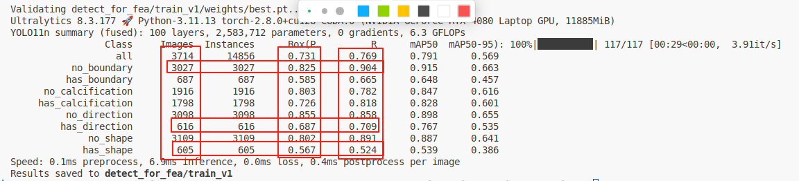

# 工作日志
上传出问题了
吃到教训了，commit全删了一天写的全没了。。。。。。。
## 上午

### yolo fea
- [x] 写代码，调试
  - 不记得本来写什么了
- [x] 调参
  - 运行成功 很明显数据量和准确度有关联
  - 不好做预处理，结束吧（本来有一长段的）

## 下午

### docker
- [x] 终于能pull了
  - 原因在llm里面

- [x] 想下载ollama中的模型，但是和openwebui不适配不知道为什么
  - 找半天没有合适的
  - 下载了huggingfacehub 还在尝试
  - docker的基本操作都没问题了，容器的状态也清楚了三种，等一会更健康~