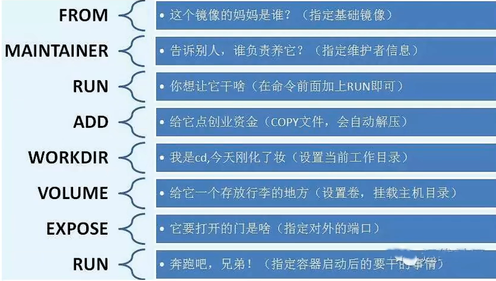

# 工作日志

## 上午

### docker
- [x] 为什么docker能比vm少一层os
  - Linux 内核提供了 namespace 和 cgroups 技术
    - namespace → 把进程的视图隔离开来（每个容器以为自己有独立的 PID、网络、文件系统）。
    - cgroups → 限制和分配资源（CPU、内存、磁盘 I/O）。
- [x] 分层下载？
  - 首先是为了效率，本地已有的就共用
  - 使用哈希id，不同镜像到同样的层就只存一份，实现不重复下载
  - 存在的层
    - 基础层
    - 系统更新层
    - 应用依赖层
    - 应用代码层
    - 配置环境层：设置环境变量、工作目录、端口等
    - 元数据层：Docker 自动生成的镜像信息
  - 底层更新，上层一般重构，旧的上层要手动上转转卖掉，否则在缓存区，新的上层会替代
- [x] 挂载卷
  - 不等于同步，没有版本管理、冲突处理、合并策略
  - 同时修改不能合并，会损失。
- [x] dockerfile
  

## 下午

- 迷茫
