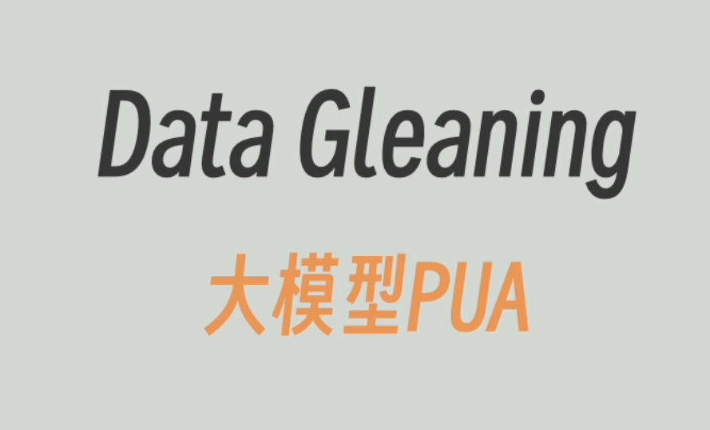
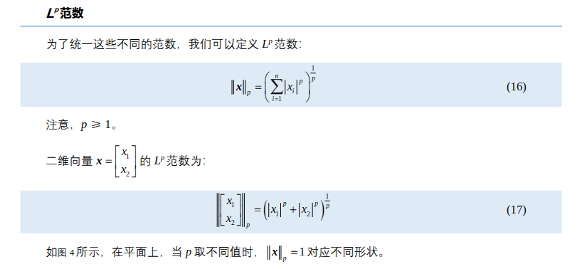
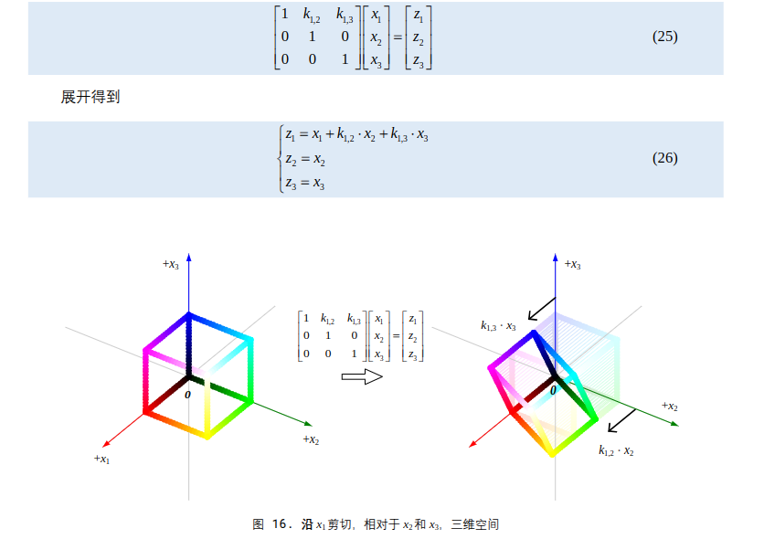

# 工作日志

## 上午

### AI
- Agent - AI model
  - function calling
  - systrm prompt 
-  Agent - AI tools
   -  MCP协议
### MCP  
- 工具托管协议（将tools和Agent解耦）
  - 1、用户给出prompt
  - 2、Agent通过MCP搜寻可用工具
  - 3、工具转换成prompt和用户的一同发往AI model
  - 4、AI model返回指令让Agent调用tools

### RAG
- 使用embedding模型（输入为prompt输出位固定长度数组）> 怎么感觉这么像KNN
  - chunking：文本切块
  - LPG（graphRAG）：生成知识图谱解决chunking导致的全局与局部不兼得的情况。
  - 反复询问榨干大模型知识以达到结果（原来我经常干的事就是data gleaning吗）

### 线性代数
-  打基础

## 下午

### 继续线代
  
- 范数
  - 
- 几何变换中，三维变换注意所处位置
> 比如：
> x2与x3分别在x1方向做剪切
- 正交投影
