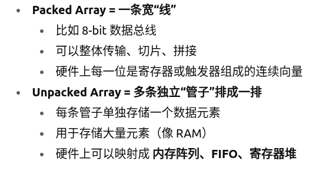

# 工作日志

## 上午

### verilog
- wire
- gate：(assign) ~ & | 
- vector
  - array
- 
> generate 循环只是代码**压缩**手段，不会在硬件里形成“for 循环”
> 实际上不是在硬件里实现类似for循环，而是编译器将其展开，不影响所谓时间复杂度
> **注意向量操作** 常见坑：把向量直接 if(a || b) → 先转换为逻辑值（非0即1）

## 下午

### 继续
- adder
  - 全加器效率低，不能同时计算，加判断同时运行
- Always block
- 看视频学习硬件，毕竟买不了板子
### 杂七杂八
- 写简历
- 看英语论文（同时在学专业相关的英语单词）以及各种书
- 准备进军fpga我觉得第一要素是把RAG先整会，不然芯片码书根本看不了。。。