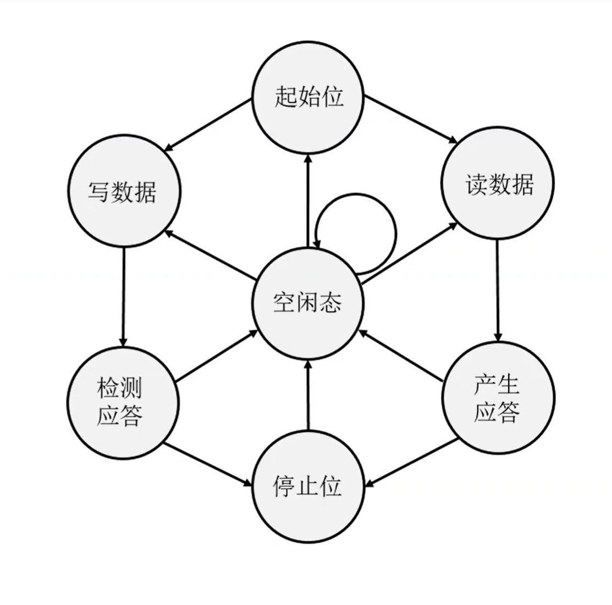
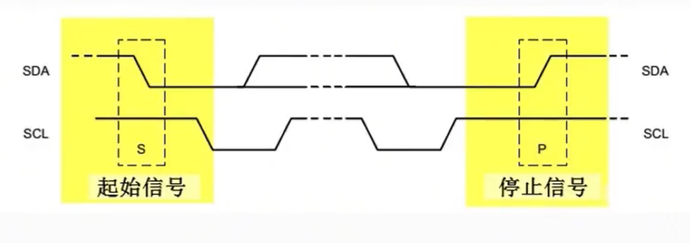
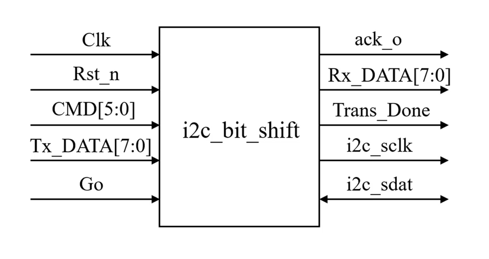
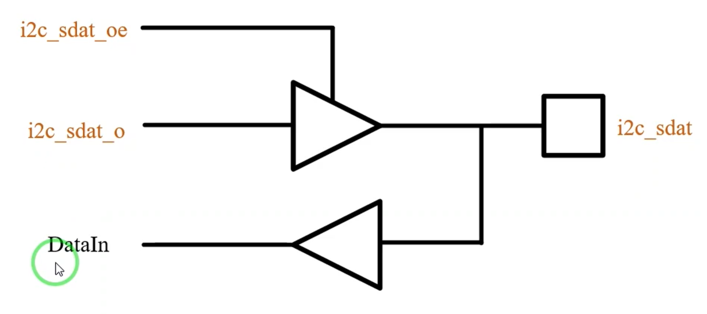
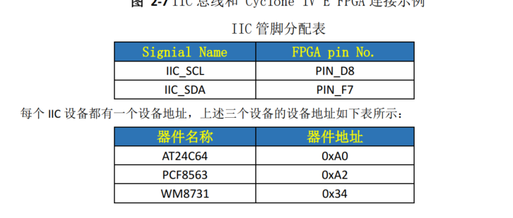

# FPGA
## I2C
- 
- 串行传输

- 起始模块（一般由主机产生）

> scl低电平期间sda可实行数据变换
> 即高电平变换时为起始与停止，低电平变换时为数据传输

- 接口模块

> i2c_sclk & i2c_sdat皆为三态门 
> 

## AXI
- AMBA其中一个（APB,AHB,AXI）
  - AXI-FULL
  - AXI-LITE
  - AXI-STREAM
> 面向存储的协议
- 写三步骤（多通道）
  - 写地址
  - 写数据
  - 等响应（I2C是应答，且对时钟要求高）
- 5个通道
  - 写地址通道
  - 写数据通道
  - 写响应通道
  - 读地址通道
  - 读数据通道
> VALID & READY同时高数据有效
> 先写地址，再写数据，最后一个数据紧跟（伴随？）LAST
> 读一样
> 写完数据有响应信号

## 板级验证
- 

## 大模型压缩
- 量化
- 剪枝
- 蒸馏
  - 通过teacher ai（虽然是黑盒）的输入输出，调整自己的模型参数，由于teacher ai中会存在神经元冗余的情况，会导致hidden layer与神经元的数量都偏多，蒸馏后可以有效缩模的同时，不降低能力。
    - 系统架构：比teacher ai的架构更加优化（如剪枝）
    - 知识结构：（个人感觉更加抽象，可能不如teacher ai丰富）需要自己构建一个知识体系架构，比如只用n个问题提问teacher ai，而这n个问题形成的知识架构能够包含所有teacher ai会的知识，并且结构得到优化。

