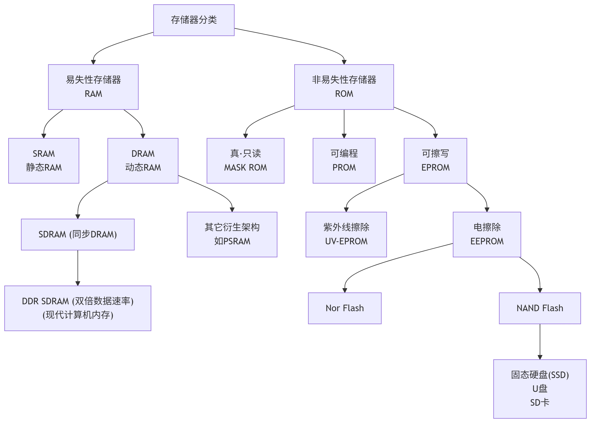
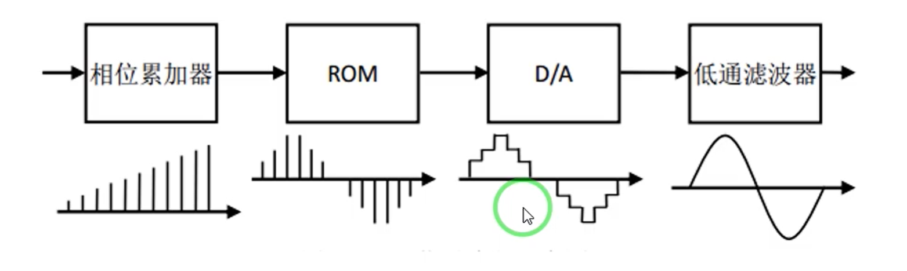
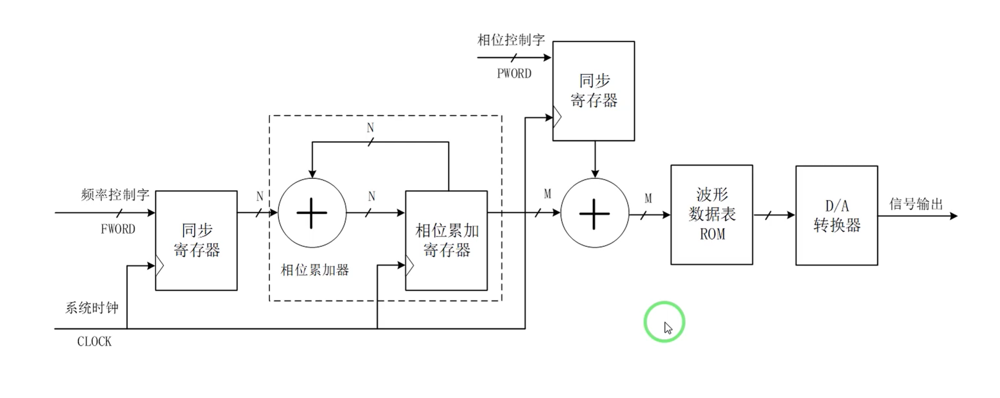

# D4
## DDS
- 相比于传统频率合成，DDS低成本低功耗，相对带宽大，频率转换时间短、分辨率高、相位连续性好。
- 模拟实现

- 代码实现的block

- rom自己用wizard做，内部数据可以自己写程序设置。

### 实现原理
- rom内部存储想要的波形
- 通过变换读取rom频率实现输出波形频率变换
  - 读的越快频率越快
- 通过改编读取rom的起始位置改变输出波形相位

## VAG
- 首先了解不同屏幕显像原理
- 了解不同屏幕驱动区别
  - oled
  - lcd
    - TN
    - IPS
    - VA(我们待会FPGA要用到的)

## 概率论（之前是线代）
- 好像终于理解概率密度函数是什么了
> 概率的概率
> 某点概率为零但是概率的概率不为零
- 
