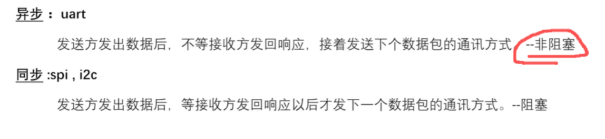

# FPGA 的各种协议

## UART
- 
## AXI深入
- 三种分类UG761
  - AXI-FULL：每次传输都要有地址
  - AXI-LITE：不传输每一个像素点的地址
  - AXI-STREAM：高速信息流传输
- 基本工作原理
  - 连接主机与从机，可以是多主多从，中间使用interconnect IP链接

## I2C


# 微机与数电基础
## 8086


```
W8\编码：隐匿在计算机软硬件背后的语言.pdf
```