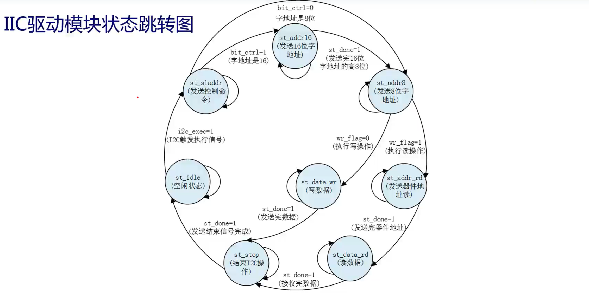
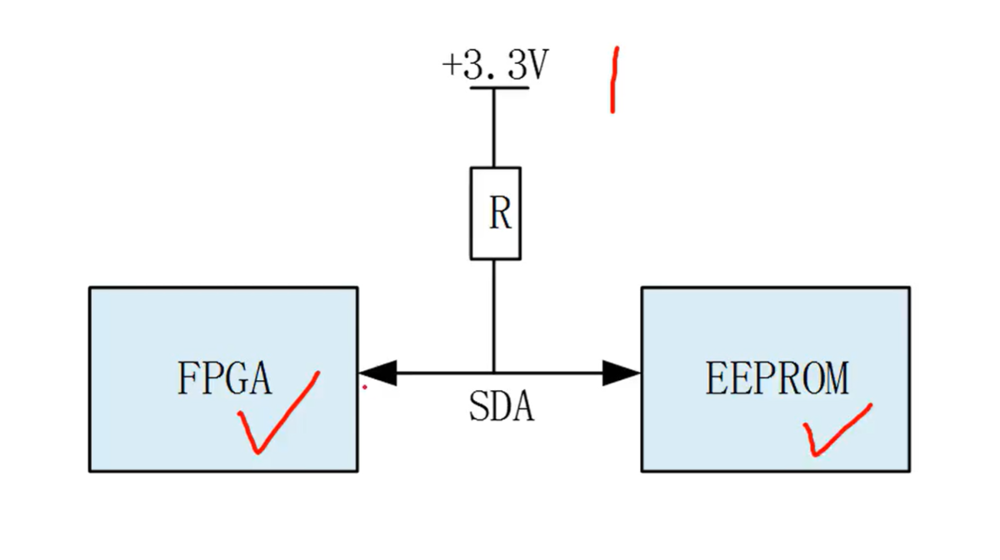
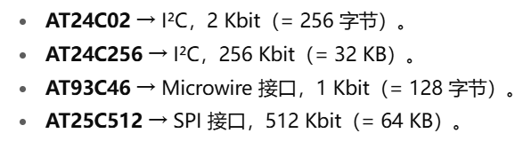

# 工作日志

## 上午

### IIC的EEPROM实验
- AT24C64eeprom的页写是不能累加到下一页，读（current address read）操作可以加到下一页
> 我觉得好理解，读不会对数据造成影响，但是写会所以需要更加慎重

- 首先空闲状态
- 发送控制命令
- 看地址的位数
- 发送地址，若为16位发两次（默认）先高八位
- 执行读/写操作，读操作需要先发重新开始信号，然后再次发送器件地址，读写控制位（最后一位）为1
- 结束读/写操作，结束IIC操作
- 回到空闲状态
**SDA**

- 有点不理解SDA的高低电平控制方式，说是看FPGA还是EEPROM释放，谁释放谁决定。
- 正常存在拉高电阻，为高电平
- 同时驱动就不对了，就为X未知电平

> 
## 下午（上面也有部分是）

### 看论文
- https://distill.pub/2021/gnn-intro/

